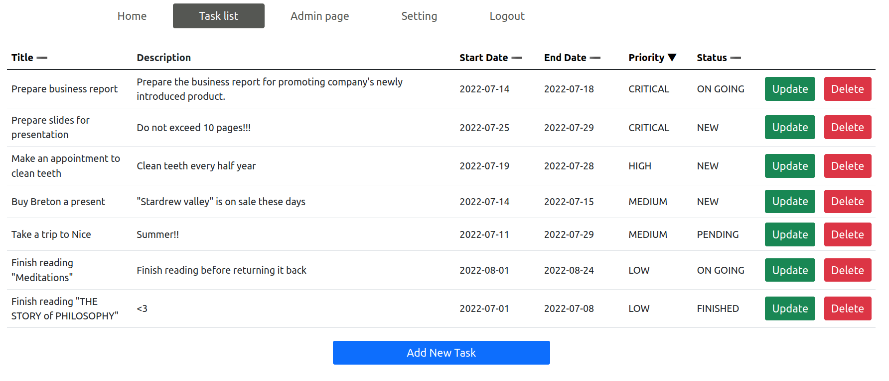
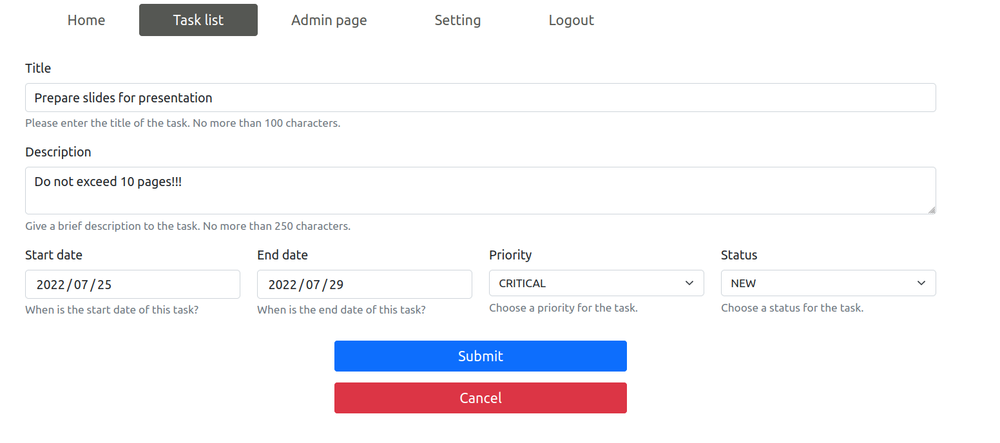
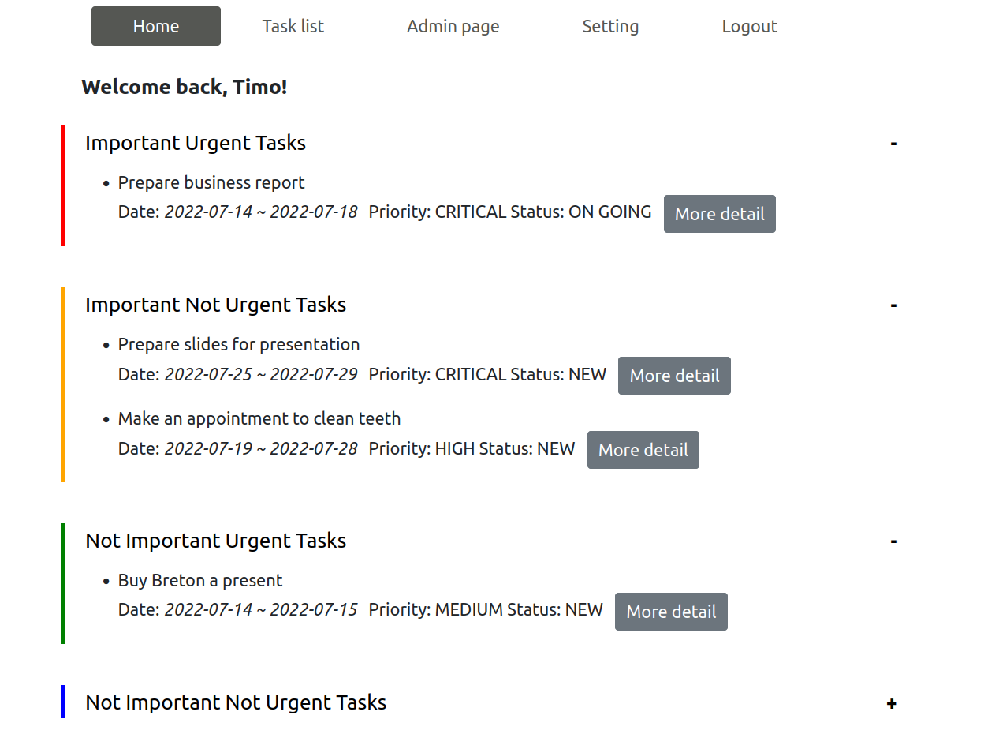
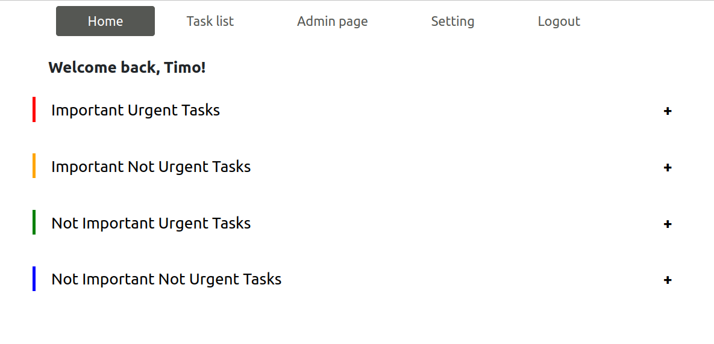
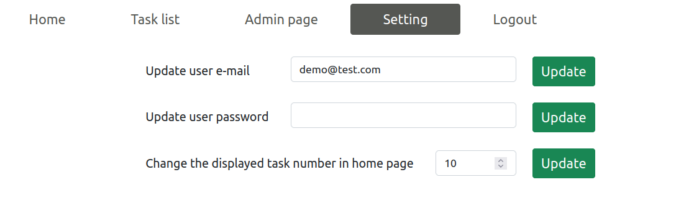

# What's Next

"What's Next" is a scheduler application for recording every important events in your daily life. With the user-friendly interface, it's easy to get started. 

## Features

### Easily manage your daily tasks

See what's in your tasklist and manage them easily.

Give each task a priority and set current status for it to track the current progress on this task.

### Clearly see what's the next thing you had better to engage on

Tasks are classified into 4 groups according to the improtance and the urgency. Once launch this app, you could quickly understant what to do next!

Feeling the home page is too croweded, collapse those you don't want to see.

### Modify your profile and customize your home page

## Installation

### Prerequisites

1. Java 16
2. Gradle
3. Spring Boot
4. Bootstrap
5. MySQL

### Steps to install

1. Import the Gradle project
2. Configure the Spring datasource in application.yaml
3. Build the project (Suggest to build the project excluding tests)

## Live demonstration

"What's next" has been deployed on Heroku. Click [the link](https://whats-next-demo.herokuapp.com) and use the following demonstrated account to have a go:

- Username: Timo
- Password: demo

## License

This project is distributed under the GNU GPL Version 3. See LICENSE.md for more information.
