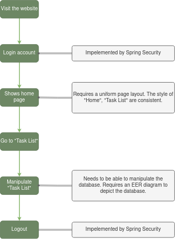
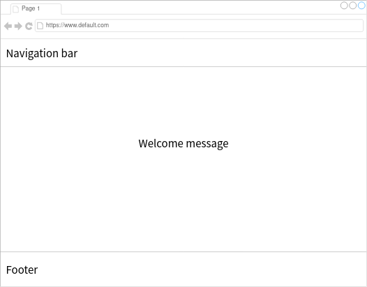

# Analysis

Time cost: Limited to 7 days

# Requirements

This application provides user to schedulize their to-do list.

1. Needs a login feature to validate user's identification.
2. A welcome page informs that user has successfully accessed the application.
3. A page shows events adding by user.
4. Each event should have a title, short description, deadline and priority.
   (May add more attributes.)
5. Needs a logout function.

# Flowchart

  

# Implementations
* Login / Logout
* Welcome page (Home page)
* EER diagram of database

## Login / Logout
Implemented by Spring Security

## Welcome page (Home page)
* The welcome page should show a message saying `Hello ${USER}!`
* The welcome page should support english, french and traditional chinese.
* (Optional) Shows current time.
* (Optional) Shows the previous login time.

